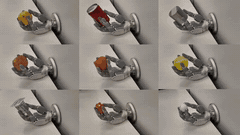
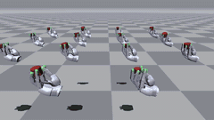
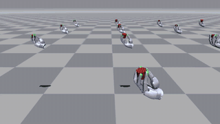

# Sharpa in-hand manipulation and HORA for UniLab

[中文](README_zh.md) | [Documentation](docs/README.md)

## Task overview

An independent UniLab task package for Sharpa Wave in-hand manipulation. It
provides a MuJoCo-ready hand/object task, bundled robot assets, grasp caches,
and PPO, APPO and FlashSAC teacher training with a shared HORA model and student
distillation pipeline.

## Highlights and demonstration

- Train policies that rotate a free cylinder inside a 22-DoF Sharpa Wave hand.
- Use tactile history, privileged critic information, and object-scale
  randomization.
- Evaluate versioned teacher/student checkpoints and record videos.
- Train a HORA teacher and distill an actor-observation student.

| Real robot | APPO | FlashSAC |
| --- | --- | --- |
|  |  |  |

## Manager-Based API

Sharpa Wave dexterous in-hand rotation now uses UniLab's current
**Manager-Based API**. The task owns action, observation, reset, event,
termination and reward terms while UniLab remains an external dependency and
owns the manager lifecycle and simulation backends. The former task-owned
legacy/direct `NpEnv` implementation and its compatibility factory have been
removed.

Supported teacher entrypoints are PPO, APPO and FlashSAC. All three algorithms
share the default HORA policy and student distillation pipeline; critics retain
the V/Q structure required by each algorithm.

## Installation and validation

The source development setup requires a UniLab 1.2-compatible checkout at
`../UniLab` beside this repository. Prepare that checkout before `uv sync`.

```bash
git clone https://github.com/unilabsim/sharpa_rl_unilab.git
cd sharpa_rl_unilab
uv sync --extra mujoco
uv run pytest
uv run pyright
```

Development uses the sibling checkout `../UniLab` as the `unilab` source; the
package dependency is still external (`unilab>=1.2.0,<1.3`), and
`unilab-rl>=1.2.0,<1.3` resolves from its release. To install this source tree
against published dependencies instead, use `pip install ".[mujoco]"` in a
separate virtual environment; pip does not apply the local `tool.uv.sources` mapping.

`uv run pytest` runs fast regression tests by default; use
`uv run pytest -m slow` for simulation and training smoke tests.
The FlashSAC smoke test requires CUDA.

## Quick start

After installation, run from the repository root to train PPO, APPO and FlashSAC
in sequence for Sharpa Wave in-hand cylinder rotation:

```bash
uv run sharpa-compare
```

In another terminal, start TensorBoard and open <http://localhost:6006> to view training curves:

```bash
uv run tensorboard --logdir logs/compare
```

Each algorithm saves its playback video after training to
`logs/compare/seed_<seed>_<timestamp>/<algorithm>/play_video.mp4`.

## Train, evaluate and distill

```bash
uv run sharpa-train --algo appo
uv run sharpa-train --algo flashsac
uv run sharpa-train --algo ppo
```

`--cfg` prints the composed Manager-Based configuration. Append Hydra overrides
to the command for tuning.

Training saves `teacher_final.pt` on completion and records `play_video.mp4`
in the same directory. Headless Linux machines use EGL or OSMesa for offscreen
rendering; on Ubuntu/Debian, install `libegl1` with a working NVIDIA graphics
driver, or `libosmesa6` for software rendering. `uv sync` does not install these
system dependencies; set `training.no_play=true` if recording is not needed.

For evaluation and distillation, specify the checkpoint file directly:

```bash
uv run sharpa-eval --checkpoint /absolute/path/to/teacher_final.pt
uv run sharpa-distill --checkpoint /absolute/path/to/teacher_final.pt
uv run sharpa-eval --checkpoint /absolute/path/to/student_final.pt
```

`uv run sharpa-compare` trains the three algorithms sequentially using their
default configurations; append `--distill --eval --num-seeds 3` to run distillation
and evaluation across multiple seeds. Each algorithm uses its own training budget;
equal sample counts or compute costs are not guaranteed.

See [in-hand rotation](docs/en/task.md) for task background and the
[training guide](docs/en/training.md) for detailed steps, runtime limitations
and checkpoint compatibility.

## Correctness notes

- Object size DR uses UniLab's fixed model-variant catalog
  (`scene_scale_0.8.xml` … `scene_scale_1.5.xml`), not mutable geom-size DR.
- Every fixed-variant body geom has a unique name, which is required by
  `mjbatch.VariantPack`.
- Each variant retains `simple="false"` on the free object. This avoids the
  reset-time mass/CoM `mj_setConst` sameframe crash.
- Tactile smoothing/latency, privileged state, incremental position targets,
  randomized actuator gains, object mass/CoM/friction/gravity and decaying
  object forces are explicit manager terms accessing state only through the Entity facade.

See [architecture](docs/en/architecture.md) and [validation](docs/VALIDATION.md).
